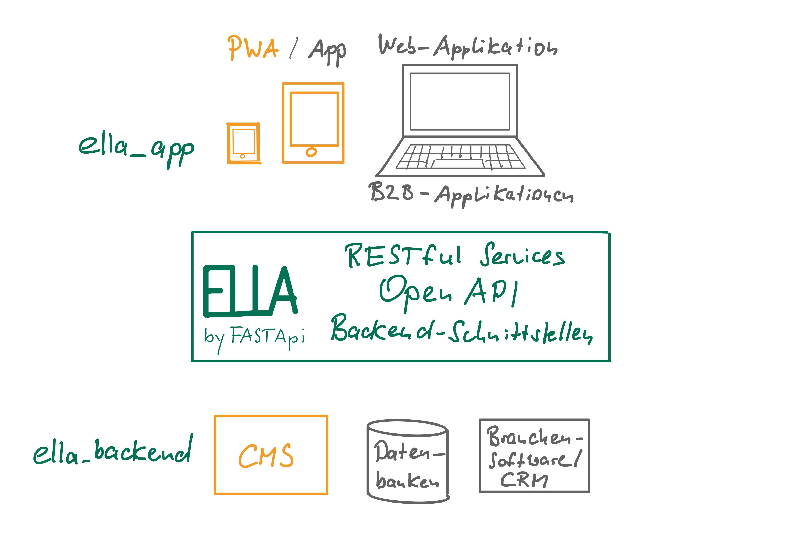
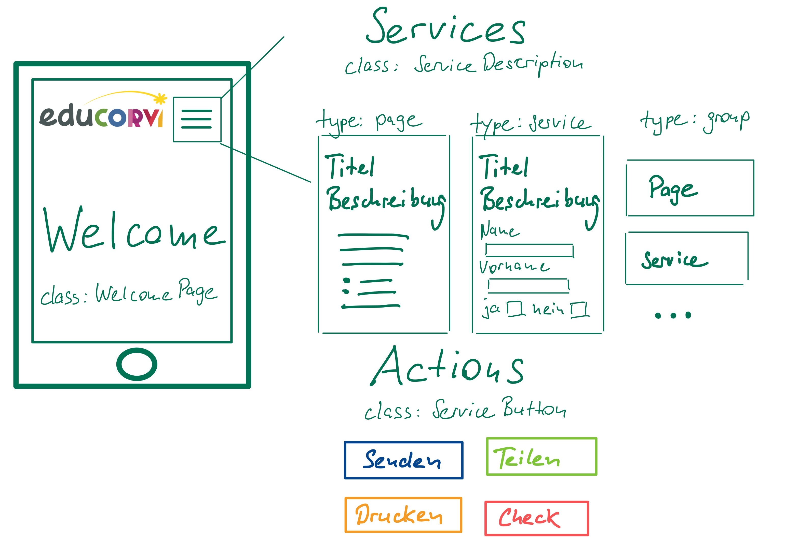

ELLA - OpenApi für "Fire and Forget" Applikationen
==================================================
Ella, elle l'a, Sängerin: France Gall, 1987 (deutsch: "Ella hat es.")
---------------------------------------------------------------------

Mit diesem Projekt wird ein OpenApi-Kontrakt zwischen einer Frontend-Applikation (**ella_app**) und 
einem oder mehreren Backend-Systemen (**ella_backend**) geschlossen. 

**ella_apps** sind Anwendungen, die nach dem "Fire and Forget" Prinzip funktionieren. Beispiele sind:

- Umfragen (Surveys) zu bestimmten Themenstellungen,
- Checklisten mit einfachen Auswertungen,
- Einfache Formulare für Anträge, Abonnements, Kontaktinformationen, Beschwerdemanagement,
- Online-Quizzes

Solche Anwendungen stehen heute in ganz verschiedenen Umgebungen für diverse Endgeräte zur Verfügung:

- als App oder Progressive Webapp (PWA)
- als Bestandteil einer Website bzw. als eine in die Seite eingebette Applikation (z.B. Umfragen auf Spiegel-Online)
- als Teil einer Unternehmens-Anwendung bzw. als Service im Intranet (Büromaterialbestellung, Büro-CheckIn, etc.)

**ella_backends** sind die Systeme zur Bereitstellung der Informationen und Formulare für die **ella_app** 
oder zum Empfang bzw.zur Auswertung der Daten und Informationen. Beispiele sind:

- ein Content-Management-System (CMS)
- ein E-Mailserver 
- eine Datenbank
- die Branchensoftware des Service-Anbieters
- ein CRM-System

Was ELLA ist
------------

ELLA ist die Komponente zwischen den beiden Welten. Die Aufgabe von ELLA besteht darin, die verschiedenen internen Schnittstellen zu
kapseln und nach aussen OpenApi-Kontrakte anzubieten wie die folgende Abbildung zeigt:

- ELLA ist die praktische Anwendung des OpenApi Standards für "Fire and Forget" Applikationen
- ELLA ist eine Sammlung von Klassendefinitionen und Funktionen, die eine Realisierung solcher Anwendungen erleichtern sollen
- ELLA ist ein dokumentiertes "HowTo" für Einsteiger in die Entwicklung von python-basierten Web-Applikationen
- ELLA bietet funktionale Beispiel-Apis für die Entwickler von Apps und Progressive Webapps
- ELLA ist Programmcode und Dokumentation auf dem Rücken eines kleinen Giganten - dem Python-Microframework FastAPI 
  (https://fastapi.tiangolo.com/) - vielen Dank #@tiangolo - Sebastian Ramirez (https://github.com/tiangolo)

Was ELLA nicht ist
------------------

- ELLA ist kein technischer oder fachlicher Framework
- ELLA selbst persistiert keine Daten, wenn Daten gespeichert werden müssen erfolgt das in einem **ella_backend**
- ELLA erhebt keinen Anspruch auf Vollständigkeit und Richtigkeit im Hinblick auf den Funktionsumfang oder die angewendeten
  Programmiertechniken - es gibt so viele bessere Programmierer...

Funktionsweise
--------------

### Fire and Forget Applikationen

#### Grundsätzliches Verständnis für die Entwicklung mit ELLA

Mit ELLA werden leichtgewichtige "Fire and Forget" Applikationen mit OpenApi's versorgt. Damit sollen Front-End-Entwickler
in die Lage versetzt werden, standardisiert und schnell zugleich eine kleine App oder Progressive Webapp (PWA) zu entwickeln,
die auf den folgenden Prinzipien beruht:

- Eine **Welcome** - Seite mit Richtext (z.B. HTML, Markdown, Restructured Text...). Mit der Welcome-Page wird eine Liste 
  von **Services** ausgeliefert, die dem Benutzer beispielsweise über ein Hamburger Menü angeboten werden können.
- **Services** können sein:
    - eine Seite (type=page) mit weiteren Informationen
    - ein formularbasierter Service (type=service)
    - eine Gruppe von Services (Seiten oder Formulare)
- **Aktions** werden durch Buttons repräsentiert. Sie dienen der Annahme, Weiterleitung oder Verarbeitung der Daten über die
  formularbasierten Services. Da ELLA selbst keine Daten speichert handelt es sich um "Fire and Forget" Aktionen, wie z.B.
    - das Senden bzw. die Weiterleitung an einen Backend per Schnittstelle oder E-Mail
    - das Drucken von Daten in ein PDF-Formular (auch in Kombination mit dem Senden)
    - das Teilen von Informationen (z.B. auf einer Website oder in sozialen Netzwerken)
    - die Überprüfung bzw. Validierung von Daten (z.B. Validierung einer Checkliste oder eines Quizzes)

Die folgende Abbildung zeigt den Aufbau einer "Fire and Forget" Applikation auf Basis des ELLA OpenApi-Kontrakts.

#### Aufbau von ELLA auf dem Filesystem

    --- /app #Verzeichnis der ELLA Applikation für den Micro-Framework FastApi
          |
          -- main.py     #Dieses Python-Modul bildet den Kern der Applikation und wird beim Serverstart aufgerufen.
          |              #Hier werden alle von ELLA nach aussen angebotenen RESTful-Webservices gespeichert. 
          |
          -- models.py   #In diesem Modul befinden sich alle in der Applikation verwendeten Datenmodelle.
          |              #FastAPI generiert aus den Datenmodellen JSON-Schemas zur Beschreibung und Validierung.
          |
          -- services.py #In diesem Modul werden alle Funktionen beschrieben, um die Apis mit Daten und
                         #und Informationen zu versorgen. Hier werden die Schnittstellen zu den ella_backends definiert.
          |
          -- examples.py #Daten für die dokumentierten ELLA Beispiele.

#### ELLA-Demosystem          

### OpenApi-Kontrakt für Web-Formulare

Mit ELLA ist ein Python-Entwickler sehr schnell in der Lage, einen OpenAPI-Kontrakt für den Empfang von Daten aus einem
Web-Formular zu entwickeln. Folgende Schritte sind zu erledigen:

#### Datenmodell zur Annahme und Validierung der Daten, die über das Web-Formular geschickt werden

Das Datenmodell muss exakt dem entsprechen, was das Webformular sendet, oder mit anderen Worten: **Dem Web-Formular wird
angezeigt welche Daten die OpenApi entgegennimmt.** Aus dem Modell generiert FastApi ein JSON-Schema zur Validierung der
Eingangsdaten.

models.py

    ...
    from pydantic import BaseModel
    ...

    class EllaContact(BaseModel):
        """
        Beispiel eines Kontakt-Formulars einer ella_app.
        """
        name : Text
        vorname : Text
        subject : Text
        message : Text
        email : Text
        telefon : Optional[Text]
        mobil : Optional[Text]

#### Datenmodell für die Antwort von ELLA an das Web-Formular

models.py

    ...
    from pydantic import BaseModel
    ...

    class ContactResponse(BaseModel):
        """
        Antwort an die ella_app nach Versand der Kontakt-Nachricht.
        - "success" Bool-Werte true oder false
        - "message" Exception-Message bei False, Success-Message bei  true
        """
        success : bool
        message : str

#### Service zur Annahme der Daten über die ELLA OpenApi

Es wird ein RESTful Webservice angeboten, der über die HTTP-Post Methode aufgerufen wird. Das response_model beschreibt
dem API Konsumenten (hier: dem Web-Formular) wie die Antwort von ELLA im Falle des Erfolges und im Falle des Misserfolges
aussieht.

main.py

    ...
    from .models import EllaContact, ContactResponse
    ...

    @app.post("/{ella_id}/contact/send", response_model=ContactResponse)
    def get_data(ella_id:str, data:EllaContact):
        """Die ella Applikation sendet die Daten passend zum EllaContact Formular. Die Daten werden
            angenommen und weitergeleitet.
        """
         return services.send_contact_data(ella_id, data)

#### Service zum Versand bzw. zur Weiterleitung der Daten

Die Weiterleitung der Daten erfolgt in diesem Fall intern über den E-Mail-Server.

services.py

    def send_contact_data(self, ella_id, data):
        if ella_id == 'ella_example_simple':
            msg = "Nachricht von: %s %s\r\n" % (data.vorname, data.name)
            msg += data.message
            msg['Subject'] = f'The contents of {textfile}'
            msg['From'] = data.email
            msg['To'] = "your.email@domain.de"
            # Senden der Nachricht über einen SMTP-Server
            try:
                s = smtplib.SMTP('localhost')
                s.send_message(msg)
                s.quit()
                return  {'success':True, 'message': 'Die Nachricht wurde erfolgreich gesendet'}
            except:
                return  {'success':False, 'message': sys.exc_info()[0]}
        raise HTTPExeption(status_code=404, detail="ella_service not found or not allowed in this context")

Installation
------------

- git clone https://github.com/educorvi/ediapis.git
- cd ediapis
- python3 -m venv env
- source ./env/bin/activate
- pip install -r requirements.txt
- pip install -r dev-requirements.txt

Starten und Stoppen des API-Servers
-----------------------------------

Entwicklung:

uvicorn app.main:app --reload

Produktion:

gunicorn app.main:app -w 4 -k uvicorn.workers.UvicornH11Worker&

